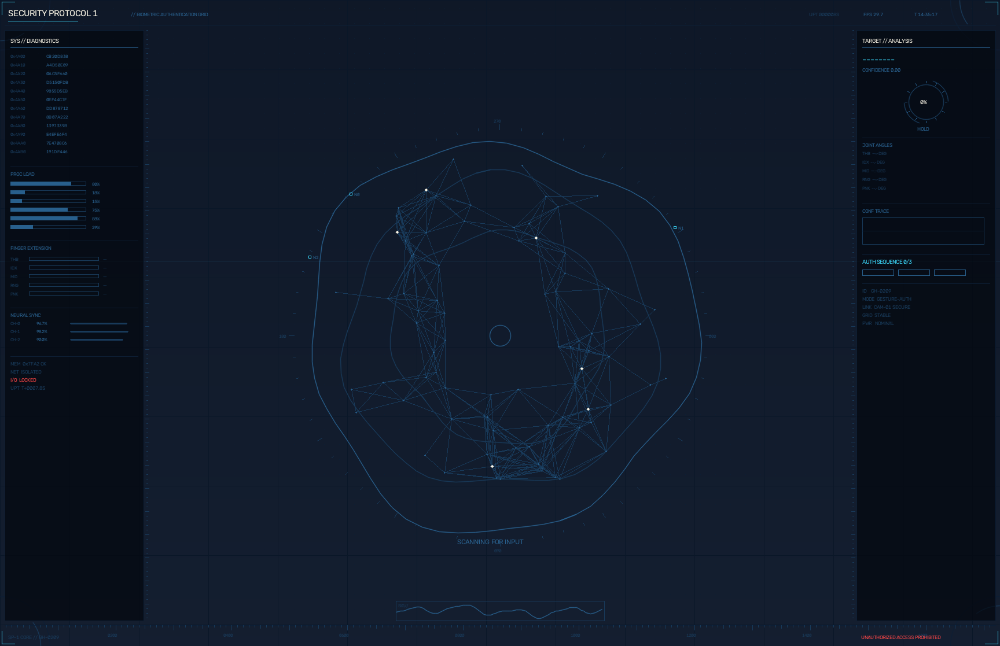

# Security-Protocol-1

카메라 손 제스처로 발동하는 macOS 락다운 시스템 — 풀스크린 JARVIS 스타일 HUD.



## 무엇을 하나

카메라에 **설정한 트리거 제스처**를 잠시 유지하면 락다운이 걸린다. 락다운은 2단계로 동작한다:

1. **셰이드 단계** — 원래 화면 위에 살짝 불투명한 검은 오버레이가 덮이고, 키보드·마우스가 차단된다. 커서 이동과 화면 중앙의 **UNLOCK 버튼 클릭만** 허용된다.
2. **인증 단계** — UNLOCK을 누르면 풀스크린 JARVIS HUD가 뜨고, **설정한 해제 제스처 시퀀스**를 카메라에 순서대로 보여줘야만 풀린다.

락다운 중에도 전원 버튼(잠금화면 진입)은 정상 동작하며, macOS 비밀번호로 세션에 복귀해도 **락다운은 그대로 유지**된다.

> 🔐 트리거 제스처, 해제 시퀀스, 비상키는 `config.local.json`(gitignore됨)에만 존재한다. 이 저장소에는 예시 설정만 포함되어 있으므로, 코드를 봐도 실제 잠금을 풀 방법은 알 수 없다.

## HUD

- 카메라 영상이 화면 전체를 채우고(다크 네이비 틴트) 그 위에 모든 요소를 렌더
- **홀로그램 오브**: 유기적으로 일렁이며 회전하는 링 3겹 + 근접 노드끼리 실시간으로 연결되는 신경망 애니메이션(80노드) — 손바닥을 따라다님
- 손 21개 관절 스켈레톤 + 손끝 ID 라벨 + 타겟 브래킷(크기·중심좌표 실측)
- 좌측 패널: 헥스 스트림, PROC 로드 바, **손가락 신장도(실측)**, NEURAL SYNC
- 우측 패널: 제스처 클래스·신뢰도, **홀드 게이지 링(실측)**, **관절 각도(실측)**, 신뢰도 트레이스 그래프, AUTH 진행 세그먼트
- 코너 회전 아크, 도트 매트릭스, 좌표 눈금자, 애니메이션 파형, 스캔라인

## 설치

```bash
git clone https://github.com/geonhee15/Security-Protocol-1.git
cd Security-Protocol-1
./setup.sh
```

`setup.sh`는 가상환경 생성 → 의존성 설치 → MediaPipe 제스처 모델 다운로드 → `config.local.json` 생성까지 자동으로 한다.

### 권한 (최초 1회)

`./install-autostart.sh`로 앱 번들을 만든 뒤에는 **SecurityProtocol1.app** 이름으로 권한을 부여한다:

1. **카메라** — 첫 실행 시 뜨는 팝업을 허용
2. **손쉬운 사용(Accessibility)** — 시스템 설정 → 개인정보 보호 및 보안 → 손쉬운 사용에서 `+`로 `SecurityProtocol1.app` 추가. 입력 차단에 필요하며, 없으면 락다운 시도가 자동 취소된다(Basso 오류음)

앱 번들 없이 `venv` python으로 직접 실행할 때는 대신 실행 주체인 터미널 앱(Terminal/iTerm)에 같은 두 권한이 필요하다.

## 해제 시도 횟수 제한

해제 제스처를 틀릴 때마다 카운트가 1씩 올라가고, **5회 실패하면 락다운을 유지한 채 macOS 잠금화면으로 전환**된다. 즉 그 이상 시도하려면 **맥 로그인 비밀번호가 필요**하므로 제스처 조합을 무한정 찍어볼 수 없다. 비밀번호로 세션에 복귀하면(= 본인 확인됨) 카운트만 0으로 리셋되고 락다운은 그대로 유지된다. HUD 우측 하단에 `ATTEMPTS LEFT 3/5`가 실시간 표시된다. 횟수는 `max_unlock_attempts`로 조절.

## 폰에서 원격 조종

알림용과 **별개의 비밀 topic**을 구독해, 폰에서 ntfy 메시지 한 줄로 맥을 조종한다. 메시지 형식은 `<token> <command>`:

| 명령 | 동작 |
|---|---|
| `lock` | 원격 락다운 발동 (자리 비울 때) |
| `unlock` | 원격 해제 — 제스처 인식이 안 될 때의 **두 번째 탈출구** |
| `snap` | 지금 카메라 사진을 찍어 폰으로 전송 (누가 내 책상에 있는지 확인) |
| `status` | 현재 상태·실패 횟수·침입 건수 응답 |

폰 ntfy 앱에서 명령 topic을 열고 메시지를 보내면 된다. 토큰이 틀린 명령이 오면 무시하고 **"topic 유출 의심" 경고 알림**을 보낸다.

> ⚠️ 명령 topic과 토큰을 아는 사람은 맥을 원격 해제할 수 있다. 알림 topic과 반드시 다른 이름을 쓰고, 원격 해제가 부담되면 `remote.allow_unlock`을 `false`로 두면 된다.

## 로그인 시 자동 시작

```bash
./install-autostart.sh     # 설치 (해제: ./uninstall-autostart.sh)
```

재부팅·로그아웃 후에도 자동으로 감시가 시작된다. 중복 실행은 파일 락으로 차단되므로 수동 실행과 겹쳐도 안전하다.

**앱 번들에 대하여** — macOS는 앱 번들이 아닌 맨 바이너리에는 카메라 권한 팝업을 띄우지 않는다(launchd 실행 시 즉시 거부됨). 그래서 설치 시 `SecurityProtocol1.app`이라는 최소 앱 번들을 만들어 ad-hoc 서명하고, 자동 시작과 수동 실행(`start.sh`)이 **같은 번들을 사용**한다. 덕분에 권한은 한 번만 부여하면 된다.

## 침입 블랙박스 & 폰 알림

- **침입 블랙박스** — 락다운 중 잘못된 해제 제스처를 하거나 키보드·마우스를 누르면, 그 순간 카메라 스냅샷을 `intruders/`(gitignore됨)에 시각·사유와 함께 저장한다. HUD 우측 하단에 `INTRUSION ATTEMPTS`가 누적 표시된다. (스팸 방지 8초 쿨다운)
- **폰 알림** — 락다운 발동·침입 시도 시 폰으로 푸시. 침입 시에는 침입자 사진까지 전송된다. `config.local.json`의 `notify.provider`로 선택:
  - `ntfy` — 폰에 [ntfy](https://ntfy.sh) 앱 설치 후 원하는 topic 구독만 하면 끝 (계정 불필요). `ntfy_topic`에 추측 어려운 이름을 넣을 것.
  - `telegram` — [@BotFather](https://t.me/botfather)로 봇 생성 → `telegram_bot_token`, 봇과 대화 시작 후 `telegram_chat_id` 입력.
  - `none` — 알림 끔 (기본값).

## 설정 — `config.local.json`

```json
{
  "trigger_gesture": "Thumb_Down",
  "trigger_hold_sec": 1.5,
  "unlock_sequence": ["Thumb_Up", "ILoveYou", "Thumb_Up"],
  "step_hold_sec": 0.8,
  "max_unlock_attempts": 5,
  "emergency_keycode": 37,
  "emergency_modifiers": ["control", "option", "command"],
  "notify": {
    "provider": "none",
    "ntfy_topic": "",
    "telegram_bot_token": "",
    "telegram_chat_id": ""
  },
  "remote": {
    "enabled": false,
    "ntfy_command_topic": "",
    "token": "",
    "allow_unlock": true
  }
}
```

- **사용 가능한 제스처**: `Closed_Fist` `Open_Palm` `Victory` `Pointing_Up` `Thumb_Up` `Thumb_Down` `ILoveYou`
- **`Double_Clap`** (트리거 전용): 박수를 두 번 치면 발동 — 탁-탁! **v5: 오디오+비전 융합, 키보드 오발동 차단.**
  주 신호는 **마이크의 음향 임펄스**다 — 박수는 짧고(<110ms 감쇠) 광대역이며 소음 바닥의
  12배 이상·절대 피크 0.10 이상 크다는 특징으로 말소리·키보드·지속 소음과 구분하고, 이런 온셋 두 개가
  0.12~1.0초 간격이면 더블 클랩 **후보**. v5 고립 규칙: 첫 박수 앞 0.6초·둘째 박수 뒤 0.5초에
  다른 임펄스가 있으면(타이핑 연타) 취소. 발동은 **최근 3초 안에 카메라에 손이 보였을 때**, 단
  **박수 소리 구간(첫 박수 −0.4s ~ 둘째 +0.25s) 내내 두 손이 멀리 떨어져 있었으면(타이핑 자세, 프레임의
  85% 이상 간격 ≥ 손크기 1.3) 거부** — 진짜 박수는 손이 겹치거나 블러로 추적이 끊겨 이 조건에 안 걸리고,
  키보드 위의 두 손은 내내 떨어져 있어 걸린다. 접촉을 긍정적으로 확인하는 방식은 세게 친 박수를 놓쳐서
  채택하지 않았다 (`clap_require_vision: false`로 해제 가능, `clap_min_peak`·`clap_peak_over_floor`·
  `clap_isolation_sec`로 민감도 조절).
  TV·문 소리 같은 외부 임펄스도 손이 없으면 차단. 비전 경로(손 추적 기반)는 보조로 유지하되
  **소리가 함께 났을 때만** 인정 — 손이 프레임을 벗어나는 무음 동작이 박수로 오인되던
  오작동을 원천 차단. 한 손만 사라진 경우(타이핑·물건 집기)도 겹침 블롭 위치 검사로
  걸러낸다. 마이크를 못 열면 자동으로 비전 단독 폴백. `clap_audio: false`로 오디오 융합을
  끌 수 있다. `./start.sh --test`로 감지 여부를 확인해볼 것 (발동 경로가 로그에 표시됨)
- **얼굴 텔레메트리** (`face_telemetry`, 기본 true): 카메라 프레임에서 MediaPipe FaceLandmarker로 입 벌림(jawOpen)·얼굴 수·정면 여부를 계산해 UDP 127.0.0.1:47831로 30Hz 송출 — Omni OS 상시 대기의 "화면 앞 사람이 지금 말하는가" 신호(카메라 권한·경합 없이 공유). `models/face_landmarker.task` 필요
- `unlock_sequence`는 원하는 길이만큼 배열로 — 길수록 안전
- `emergency_keycode`는 macOS 가상 키코드 (예: A=0, S=1, L=37, ...), `emergency_modifiers`는 `control`/`option`/`command`/`shift` 조합
- **비상키 조합을 누르면 락다운을 풀고 즉시 macOS 기본 잠금화면으로 전환** — 맥 비밀번호 없이는 못 들어오므로 보안이 유지된다

## 실행

```bash
./start.sh --test   # 인식 테스트만 (락다운 없음)
./start.sh          # 상시 감시 가동
```

종료는 실행 중인 터미널에서 `Ctrl+C`, 또는 다른 터미널에서 `pkill -f security_protocol.py`.

**소리 의미**: Sosumi(삐) = 입력 차단 확정 · Tink(틱) = 해제 단계 성공 · Glass(띠링) = 해제 · Basso(둔탁) = 오버레이 표시 실패로 락다운 자동 취소

## 벽돌 방지 안전장치

이런 종류의 도구는 잘못 만들면 자기 기기를 벽돌로 만든다. 다음 장치들이 겹겹이 들어있다:

- 입력 차단용 이벤트 탭(CGEventTap)은 **락다운 중에만 존재** — 해제 시 mach port까지 완전 파괴하므로, 락다운이 아닌데 입력이 차단되는 상태가 구조적으로 불가능
- 오버레이가 **WindowServer에 실제로 표시된 것을 확인한 뒤에만** 입력 차단 (macOS의 창 표시가 비동기라 이 확인이 필수)
- **워치독(2초마다)**: 잠금 아닌데 탭이 남아있으면 강제 제거, 락다운 중 오버레이가 사라지면 안전 해제 후 macOS 잠금화면 전환
- 해제·비상탈출·macOS 잠금해제 직후 쿨다운 (재발동 방지), macOS 잠금화면에서는 트리거 무시
- macOS 잠금화면(전원 버튼 등) 중에는 이벤트 탭이 전부 통과 — 비밀번호 입력을 방해하지 않고, 세션 복귀 시 차단이 즉시 재개되며 락다운은 유지됨
- 락다운 중 카메라가 죽으면 자동으로 macOS 잠금화면 전환
- 제스처 인식 디바운싱: 프레임 단위 인식 깜빡임(0.5초 이내)은 유지로 간주
- 모든 이벤트가 `protocol.log`에 기록 (gitignore됨)

## 로그인 시 자동 시작 (선택)

`~/Library/LaunchAgents/com.<이름>.security-protocol-1.plist`를 만들어 `ProgramArguments`에 `<프로젝트경로>/venv/bin/python`과 `<프로젝트경로>/security_protocol.py`를 넣고 `RunAtLoad`/`KeepAlive`를 true로 설정한 뒤 `launchctl load` 하면 된다. launchd로 실행하면 python 바이너리 자체에 카메라/손쉬운 사용 권한을 부여해야 할 수 있다.

## 한계

- 전원 버튼 강제 재부팅은 소프트웨어로 막을 수 없다 — 재부팅 후에는 macOS 로그인 비밀번호가 최종 방어선이므로 **FileVault + 로그인 비밀번호**를 켜둘 것
- SSH가 열려 있으면 원격에서 프로세스를 종료할 수 있다 (역으로 비상 탈출구로도 활용 가능)
- 웹캠 지문 인식은 해상도 한계로 불가능

## 스택

Python 3.12 · [MediaPipe](https://developers.google.com/mediapipe) GestureRecognizer · OpenCV · PyObjC (AppKit/Quartz)
